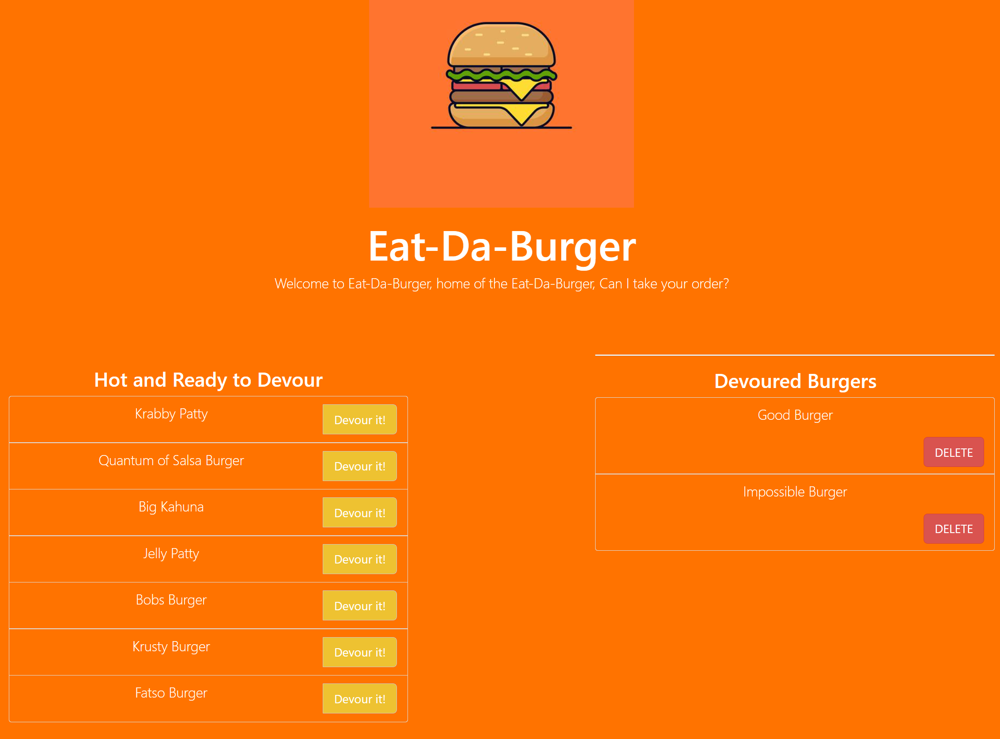

# Eat-Da-Burger

## Table of Contents
* [Description](#Description)
* [Features](#Preview)
* [Installation](#Installation)
* [Technologies](#Technologies)
* [Dependencies](#Dependencies)
* [Contribution](#Contribution)
* [Links](#Links)

## Description
Welcome to Eat-Da-Burger, home of all the burgers, can we take your order?

This application allows users to keep track of burgers that are hot and ready to serve and inducts devoured burgers into a seperate list to be remembered by



## Features
* Keep track of burgers that eaten and ready-to-eat
* Add new burgers to the grill

## Installation
1. Clone Repository
2. Open desired terminal
3. Run the following command:
```
npm install
```
## Technologies 
* HTML
* CSS
* JavaScript
* Bootstrap
* JQuery
* Heroku

## Dependencies
* Express
* Handlebars
* MySql

## Contribution
Direct any questions, comments, or issues to:
Amor Andal: [Email](mailto:aandal77@gmail.com) | [GitHub Profile](https://www.github.com/andal-a)

## Links
[Eat-Da-Burger](https://quiet-castle-37000.herokuapp.com/)